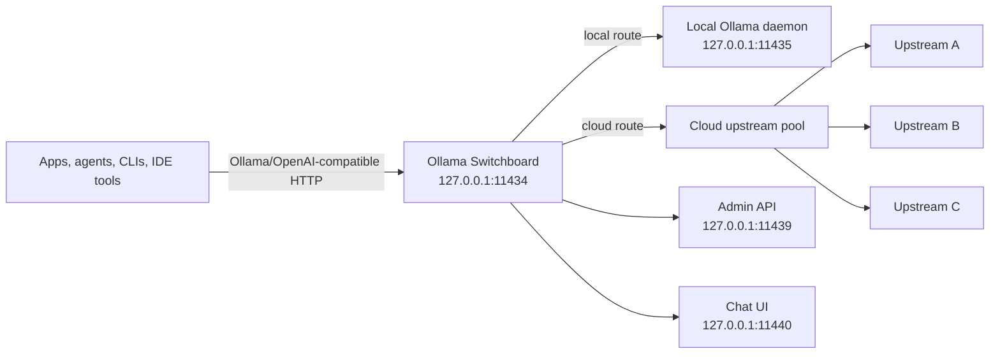
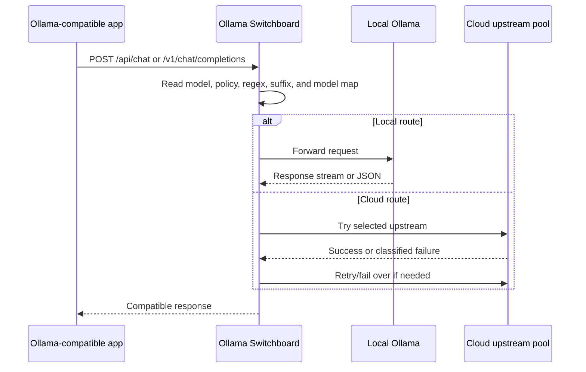
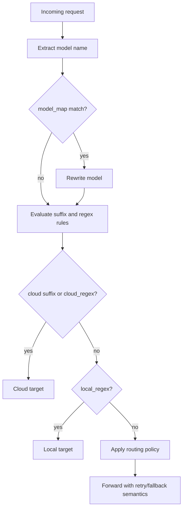

# Ollama Switchboard

**A local Ollama-compatible gateway for unlimited local usage, smart routing, and resilient failover.**

Ollama Switchboard (`osb`) is a local proxy and background service that sits in front of Ollama-compatible clients. It keeps your applications pointed at one stable endpoint while routing requests to local Ollama or configured cloud upstreams with retries, cooldowns, and failover.

It is designed for developers, AI agents, automation scripts, and local tools that need a dependable Ollama endpoint without constantly editing app settings when a model, upstream, API key, or provider becomes unavailable.

## Unlimited Ollama Usage

Ollama Switchboard helps you get **unlimited Ollama usage for local workloads** by keeping your apps connected to a local-first gateway. Use local models through a stable Ollama-compatible endpoint without per-request billing, then optionally add cloud upstreams for overflow, fallback, or specific model routes.

Cloud providers and third-party upstreams still have their own quotas, pricing, and rate limits. Switchboard does not bypass provider limits; it gives you a professional routing layer so local usage stays smooth and cloud usage is controlled.


## Why This Exists

Most local AI tools expect one Ollama endpoint. That works well until:

- a local daemon is moved to another port;
- a cloud key hits quota or rate limits;
- one upstream is slow or temporarily unavailable;
- different models should route to different providers;
- a UI or agent needs a stable endpoint regardless of backend changes.

Switchboard solves this by becoming the fixed endpoint your apps use. It reads your routing policy, checks the request model, chooses a target, retries failures where safe, and records runtime state through an admin API.

## Current Features

- Ollama-compatible local gateway on `127.0.0.1:11434` by default.
- Configurable proxy, admin, and UI listener addresses.
- Local-first routing for unlimited local model usage.
- Routing policies: `auto`, `local-only`, `cloud-only`, `prefer-local`, and `prefer-cloud`.
- Model-based routing with `cloud_suffix`, `local_regex`, `cloud_regex`, and `model_map`.
- Cloud upstream pool with cooldown, round-robin selection, and retry classification.
- Failover handling for timeouts, unavailable upstreams, 429 responses, 5xx responses, invalid credentials, and quota-like errors.
- Streaming modes for safer buffered responses or lower-latency live proxying.
- Admin API with optional token protection.
- CLI workflow for setup, serve, status, add, remove, reload, doctor, and chat.
- Browser chat UI for quick smoke tests.
- JSON and YAML configuration support with human-readable duration strings.
- Focused test coverage for config parsing, routing, admin auth, UI proxying, and proxy fallback behavior.

## Architecture



## Request Flow



## Routing Model

Switchboard makes a route decision from request content and config:



Policy behavior:

| Policy | Primary behavior |
| --- | --- |
| `auto` | Uses explicit suffix/regex routing, otherwise local. |
| `local-only` | Always uses the local upstream. |
| `cloud-only` | Always uses the configured cloud upstream pool. |
| `prefer-local` | Tries local first, then falls back to cloud. |
| `prefer-cloud` | Tries cloud first, then falls back to local. |

## Quickstart

Install:

```bash
go install github.com/0PeterAdel/ollama-switchboard/cmd/osb@latest
```

Create config:

```bash
osb setup --yes
```

Run the service:

```bash
osb serve
```

In another shell:

```bash
osb doctor
osb status --json
osb chat --model llama3 "hello from switchboard"
```

Open the local chat UI:

```bash
osb ui
```

## Adding Cloud Upstreams

Add a cloud upstream by storing the API key in the local secret store:

```bash
export OLLAMA_KEY_1="your-api-key"
osb add --name work-1 --api-key-env OLLAMA_KEY_1
osb reload
```

List configured upstreams:

```bash
osb list
```

Remove an upstream:

```bash
osb remove work-1
```

## Configuration

Switchboard supports JSON and YAML config files. The default path is platform-specific and created by `osb setup`.

Example files:

- `examples/config.example.json`
- `examples/config.example.yaml`

Common fields:

| Field | Purpose |
| --- | --- |
| `listen_address` | Public local gateway used by Ollama-compatible clients. |
| `admin_address` | Local admin API listener. |
| `ui_address` | Browser chat UI listener. |
| `local_upstream` | Real local Ollama daemon target. |
| `routing.policy` | Routing policy for local/cloud selection. |
| `routing.local_regex` | Model patterns that should stay local. |
| `routing.cloud_regex` | Model patterns that should use cloud. |
| `retry.*` | Attempts, timeout, backoff, and cooldown behavior. |
| `security.admin_token_required` | Enables admin API token checks. |
| `upstreams` | Cloud upstream definitions. |
| `model_map` | Optional model rewrite map. |

Durations accept readable strings such as `60s`, `300ms`, and `2m`.

## CLI Reference

| Command | Description |
| --- | --- |
| `osb setup --yes` | Create config and print local Ollama setup guidance. |
| `osb serve` | Run proxy, admin API, and UI servers. |
| `osb status --json` | Read daemon status from the admin API. |
| `osb add` | Add a cloud upstream and sync it to the daemon. |
| `osb remove` | Remove an upstream and sync the daemon. |
| `osb reload` | Reload upstream definitions into the running daemon. |
| `osb list` | Print configured upstreams. |
| `osb doctor` | Validate local runtime connectivity. |
| `osb chat` | Send a quick test chat request through the gateway. |
| `osb ui` | Print the local UI URL. |

## Security Model

Switchboard is local-first and binds to localhost by default. This is intentional: the gateway may forward authenticated model requests and manage upstream API keys.

Security defaults:

- Proxy, admin, and UI addresses are local by default.
- Admin token protection can be enabled with `security.admin_token_required`.
- Secrets are stored in a user-local file with restrictive permissions.
- CLI output prints fingerprints, not raw API keys.
- The project does not log plaintext secrets by design.

If you bind any listener to a non-localhost interface, enable admin token protection and place the service behind a trusted network boundary.

## Limitations

- Switchboard does not bypass cloud provider quotas or billing.
- Unlimited usage means local Ollama usage is not metered by Switchboard; your hardware, model size, memory, and local daemon availability still apply.
- Safe streaming buffers upstream responses before returning them.
- OS-native service installation is still evolving.
- Secret storage is file-based in this milestone; OS keychain support is a future hardening target.

## Repository Layout

```text
cmd/osb/                 CLI entrypoint
internal/admin/          Admin API and auth
internal/cli/            CLI command handlers
internal/config/         Config loading, validation, JSON/YAML support
internal/proxy/          HTTP proxy and failover behavior
internal/router/         Routing decisions and model rewrites
internal/ui/             Embedded local chat UI
internal/upstream/       Cloud upstream runtime manager
docs/                    Architecture, setup, configuration, and security docs
examples/                Example configuration files
test/                    Integration tests
```

## Development

Run the test suite:

```bash
go test ./...
```

Run vet:

```bash
go vet ./...
```

Build the CLI:

```bash
go build ./cmd/osb
```

## Documentation

- `docs/architecture.md`
- `docs/setup.md`
- `docs/configuration.md`
- `docs/security.md`
- `docs/troubleshooting.md`
- `docs/faq.md`

## Contributing

Contributions are welcome. Read `CONTRIBUTING.md`, `SECURITY.md`, and `CODE_OF_CONDUCT.md` before opening a pull request.

## License

See `LICENSE`.
