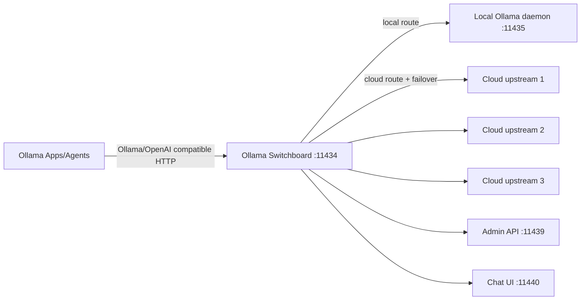

# Ollama Switchboard

**A local failover gateway for Ollama that keeps your apps running.**

Ollama Switchboard (`osb`) is a local proxy + background service that sits in front of Ollama-compatible clients and transparently routes requests to local Ollama or cloud upstreams with automatic retry/failover.

## Why this exists

When one cloud identity/API key hits quota/rate/availability issues, existing apps often fail hard. Switchboard replays the same request against the next healthy upstream and only returns failure when all upstreams fail.

## Current milestone features (v0.1.0)

- Local gateway on `127.0.0.1:11434` with configurable addresses.
- Routing engine (`local`, `cloud`, `auto`, `prefer-local`, `prefer-cloud`).
- Cloud upstream pool with cooldown and round-robin selection.
- Retry/failover classification for 429/5xx/timeouts/auth failures.
- Safe-stream (buffered) and live-stream compatibility behavior.
- CLI commands: `setup`, `serve`, `status`, `add`, `remove`, `list`, `doctor`, `chat`, `logs`, `version`, `uninstall`, etc.
- Local admin API (`/admin/status`, `/admin/upstreams`, `/healthz`, `/readyz`).
- Simple local chat page for smoke testing (`http://127.0.0.1:11440`).

## Architecture



## Quickstart

```bash
go install github.com/ollama-switchboard/ollama-switchboard/cmd/osb@latest
osb setup --yes
osb serve
```

In another shell:

```bash
osb add --name work-1 --api-key-env OLLAMA_KEY_1
osb status --json
osb chat --model llama3 "hello from switchboard"
```

## Setup behavior

`osb setup` currently creates and validates config, writes backups, and prints explicit instructions for moving real Ollama to `127.0.0.1:11435` (`OLLAMA_HOST`) in a reversible way.

## Security notes

- Localhost binding by default.
- Secrets stored in user-local file (`600`) in this milestone; no plaintext logging.
- API keys are masked/fingerprinted in output.

## Limitations (documented)

- Full OS-native service install automation is scaffolded but still evolving.
- Safe-stream is implemented by buffering full upstream response in v0.1.
- Dynamic in-process `enable/disable/reload` is basic in this milestone.

## Docs

- `docs/architecture.md`
- `docs/setup.md`
- `docs/configuration.md`
- `docs/security.md`
- `docs/troubleshooting.md`
- `docs/faq.md`

## Contributing

See `CONTRIBUTING.md` and `CODE_OF_CONDUCT.md`.
