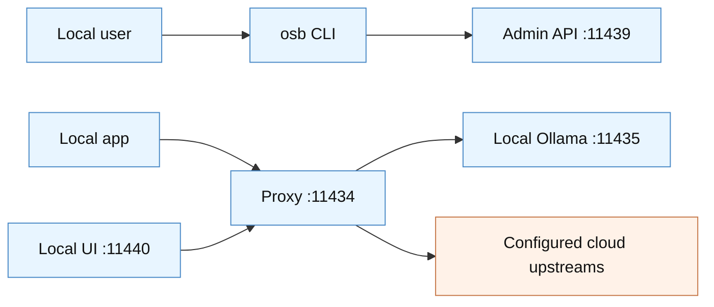

# Security Policy

Ollama Switchboard is a local gateway that can forward model requests and use upstream API keys. Security reports are taken seriously because a misconfiguration or vulnerability could expose private prompts, API tokens, local services, or model traffic.

## Supported Versions

The project is early-stage. Security fixes are applied to the default branch and the latest released version when releases are available.

| Version | Supported |
| --- | --- |
| Latest `main` | Yes |
| Latest tagged release | Yes, when tags exist |
| Older snapshots | No |

## Reporting a Vulnerability

Please report security issues privately. Do not open a public issue for vulnerabilities.

Preferred reporting path:

1. Open a GitHub Security Advisory for this repository.
2. Include a clear description, affected component, reproduction steps, and impact.
3. Include logs or proof-of-concept details only if they do not expose real secrets.

If GitHub Security Advisories are not available, contact the maintainer through the repository owner profile and avoid posting exploit details publicly.

## What to Include

A useful report includes:

- affected version or commit SHA;
- operating system and architecture;
- relevant config fields with secrets redacted;
- exact command or request used to reproduce the issue;
- expected behavior;
- actual behavior;
- security impact;
- whether the issue is local-only or remotely exploitable;
- suggested fix, if known.

Never include real API keys, bearer tokens, private prompts, private model outputs, or customer data.

## Security Scope

In scope:

- admin API authentication bypass;
- secret leakage through logs, CLI output, UI, or error messages;
- unsafe forwarding of authorization headers;
- unintended remote exposure from listener binding behavior;
- config parsing issues that disable security controls;
- request smuggling or proxy behavior that can reach unintended targets;
- path handling issues in local storage;
- vulnerabilities in retry/failover behavior that expose secrets to the wrong upstream.

Out of scope:

- cloud provider quota limits or billing policy;
- vulnerabilities in upstream model providers;
- vulnerabilities in Ollama itself;
- denial of service caused only by intentionally exhausting local machine resources;
- issues that require already having full local user access without privilege escalation;
- reports without a concrete security impact.

## Default Security Model



By default:

- proxy, admin API, and UI listeners bind to localhost;
- upstream API keys are stored in a user-local file with restrictive permissions;
- CLI output uses fingerprints instead of printing raw secrets;
- admin token protection can be enabled for admin endpoints;
- request forwarding is intentionally limited to configured upstreams.

## Admin API Protection

If `security.admin_token_required` is enabled, admin requests must include one of:

```text
X-OSB-Admin-Token: <token>
Authorization: Bearer <token>
```

The token can be configured through `security.admin_token` or the `OSB_ADMIN_TOKEN` environment variable.

Use admin token protection when:

- binding admin endpoints outside localhost;
- running on shared machines;
- running inside containers with shared networks;
- exposing the UI through a tunnel, reverse proxy, or remote desktop workflow.

## Secret Handling

Current milestone behavior:

- upstream secrets are stored in a local file;
- file permissions are restricted where supported by the OS;
- secrets are loaded at runtime for outbound upstream calls;
- secrets should not be logged or printed.

Recommended practices:

- use dedicated API keys for Switchboard;
- rotate keys after testing incidents;
- do not paste keys into issues, PRs, logs, or screenshots;
- prefer environment variables for CLI input, for example `--api-key-env OLLAMA_KEY_1`;
- keep config and secret files outside synced public folders.

Future hardening target:

- OS keychain or platform-native secure storage.

## Network Exposure Guidance

Localhost binding is the safest default. If you bind to `0.0.0.0`, a LAN address, or a public interface:

- enable admin token protection;
- place the service behind a trusted firewall;
- avoid exposing the proxy directly to the public internet;
- use TLS termination at a trusted reverse proxy;
- restrict which clients can reach the service;
- document who is allowed to use the gateway.

## Disclosure Process

Expected process:

1. Report is received privately.
2. Maintainers confirm whether it is reproducible.
3. A fix is prepared in a private branch or advisory workflow when appropriate.
4. Tests are added for the vulnerability.
5. A release or patch is published.
6. The advisory is disclosed with credit if the reporter wants attribution.

## Security Checklist for Maintainers

Before merging security-sensitive changes:

- Confirm no plaintext secrets appear in logs or errors.
- Confirm admin endpoints enforce token checks when configured.
- Confirm config validation fails closed for invalid security settings.
- Confirm tests cover unauthorized and authorized cases.
- Confirm proxy headers cannot leak one upstream token to another upstream.
- Confirm documentation explains any new exposure or trust boundary.

## Dependency Updates

Dependency updates should be reviewed like code changes. Automated dependency PRs are disabled in this repository to keep contributor attribution and review flow predictable. Maintainers should update dependencies manually and verify the full test suite.
